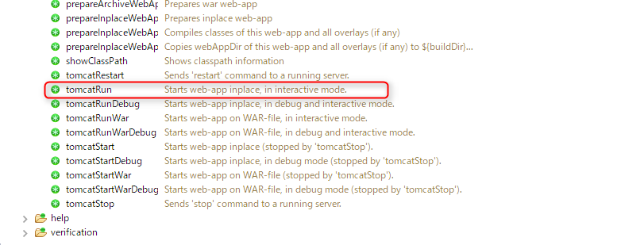

# Gradle × JAX-RS のサンプル

JAX-RSの実装である jersey による REST API の実装と、
ついでに Gradle と Eclipse で開発デバッグするサンプルです。

札幌の新人に ajax を教えるために手ごろな mock サーバー作ろうとしたのですが、
node じゃ node インストールしないといけないし、ちょうど JavaでRESTやってるらしいし、
gradle なら Eclipseさえあれば動くしソースも見れるということで作成しました。

Gradleのサンプルにちょうど良いと思ったので適当にテストを書いて公開します。

結局サーバー立てて設定するので半日つぶれて ajax のサンプルは書けてないです（本末転倒）。

## 使い方

### Eclipseで動かす
[Buildship](https://projects.eclipse.org/projects/tools.buildship) v1.0.20 以上が必要です。
Eclipse Marketplace からダウンロード・インストールしてください。

バージョンを確認してください。 v1.0.18 以下ではバグがあり、EclipseとGradleの連携がうまくいきません。

Eclipse を起動したら、 `file` > `インポート` で `Gradle プロジェクト` を選択します。

設定はデフォルトで構いません。

Gradleタスクウィンドウが開かれると思うので、

`tomcatRun` を選択します。
ライブラリなどが自動でダウンロードされます（初めての場合結構時間がかかります）





しばらくしたらTomcatが起動するので、

http://localhost:8080/gradle-with-jaxrs/

にアクセスします。

Gradleタスクの標準出力は、コンソールに出力されます。
コンソールで何かボタンを押すことでもサーバーを止めることが出来ます。

うまく動かない場合は eclipse タスクを実行して、必要ファイルを作成後、プロジェクトをリフレッシュしてください。
（自動で出来ると思ってるんだけど違うかも）

### コマンドを直接叩く

プロキシ設定は gradle.properties に書いてあります。
いちいち書き換えるのが面倒でしたら、`~/.gradle` 以下においてください。

```sh
> .\gradlew tomcatRun
```

## ポイント

### ソースの読むべきところ
ソースの読み方として、読み始める場所は `web.xml`です。
src/main/webapp 以下がGradleにおける WebContents の置き場所です。

```xml
	<!-- Jerseyの読み込み -->
	<servlet>
		<servlet-name>JerseyRest</servlet-name>
		<servlet-class>org.glassfish.jersey.servlet.ServletContainer</servlet-class>
		<init-param>
			<param-name>javax.ws.rs.Application</param-name>
			<param-value>jp.sgk.jaxrs.sample.SimpleApplication</param-value>
		</init-param>
		<load-on-startup>1</load-on-startup>
	</servlet>
	<servlet-mapping>
		<servlet-name>JerseyRest</servlet-name>
		<url-pattern>/api/*</url-pattern>
	</servlet-mapping>
```

細かい設定はこのSimpleApplicationクラスで行っています。

```java
/**
 *
 * Apiアプリケーションの設定クラス
 *
 * @author HANIYAMA
 *
 */
public class SimpleApplication extends ResourceConfig{
    public SimpleApplication() {
    	//読み込むAPIソースパッケージ
        packages("jp.sgk.jaxrs.sample.api");
        //JSON変換クラスの登録
        this.register(MoxyFilteringFeature.class);
        //Jackson使うなら以下に変更
        //this.register(JacksonFeature.class);
        //UTF8に変換数フィルターを登録
        this.register(UTF8Filter.class);
    }

}
```

実際のAPIは`jp.sgk.jaxrs.sample.api`にあります。
中身は読めばなんとなくわかると思います。

### Tomcat
Tomcatを動かしているのは `getty` プラグインというプラグインです。
Eclipseのデバッグと連携するには、 `tomcatRunDebug` タスクを実行すると、
デフォルトで5005ポートでリモートデバッグを待ち受けるので、Eclipseのデバッグで接続します。


### 依存関係

依存関係はこんな感じです。

```groovy:build.gradle
dependencies {
    compile group: 'org.glassfish.jersey.containers', name: 'jersey-container-servlet-core', version:'2.+'
    compile group: 'org.glassfish.jersey.media', name: 'jersey-media-moxy', version:'2.+'
    compile group: 'com.fasterxml.jackson.core', name: 'jackson-databind', version: '2.+'
    compile group: 'com.fasterxml.jackson.core', name: 'jackson-annotations', version: '2.+'
    testImplementation group:'org.glassfish.jersey.test-framework.providers', name: 'jersey-test-framework-provider-grizzly2', version:'2.+'
    testImplementation group: 'junit', name: 'junit', version:'4.12'
}
```

